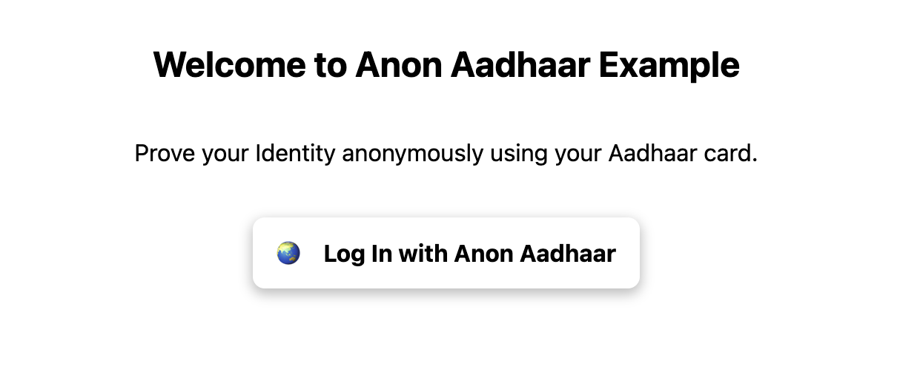

# Building a Voting App with Anon Aadhaar Integration

## Introduction

Welcome to our step-by-step guide on creating a voting application with Anon Aadhaar integration. In this tutorial, we'll walk you through the process of setting up a Next.js application, integrating the Anon Aadhaar SDK, and connecting it to a smart contract for secure and private voting.

### Target Audience

This tutorial is suitable for developers familiar with JavaScript and Next.js who want to implement secure and privacy-preserving voting using Anon Aadhaar.

### Prerequisites

Before you begin, make sure you have the following:

- Knowledge of TypeScript
- Node.js and Yarn installed
- Basic understanding of Next.js

## Table of Contents

- [Building a Voting App with Anon Aadhaar Integration](#building-a-voting-app-with-anon-aadhaar-integration)
  - [Introduction](#introduction)
    - [Target Audience](#target-audience)
    - [Prerequisites](#prerequisites)
  - [Table of Contents](#table-of-contents)
  - [Create your Next.js app](#create-your-nextjs-app)
  - [Integrate the AnonAadhaar React Components Library](#integrate-the-anonaadhaar-react-components-library)
  - [Connect a wallet](#connect-a-wallet)
  - [Create our voting smart contract](#create-our-voting-smart-contract)
  - [Calling the voting smart contract from our frontend](#calling-the-voting-smart-contract-from-our-frontend)
  - [Conclusion](#conclusion)

## Create your Next.js app

To get started, let's create a new Next.js application.

```sh
yarn create next-app anon-aadhaar-vote
cd anon-aadhaar-vote
```

## Integrate the AnonAadhaar React Components Library

Next, we'll integrate the AnonAadhaar React Components Library into our Next.js app.

```sh
yarn add anon-aadhaar-react
```

Generate you application ID by running this script:

```typescript
import crypto from "crypto";

const app_id = BigInt(
  parseInt(crypto.randomBytes(20).toString("hex"), 16)
).toString(); // random value.
```

Add this in your `.env.local` file.

```bash
NEXT_PUBLIC_APP_ID="your-app-id"
```

At the root of your app add the AnonAadhaar Provider, in \_app.tsx file:

```jsx
import "@/styles/globals.css";
import type { AppProps } from "next/app";
import { AnonAadhaarProvider } from "anon-aadhaar-react";

const projectId = process.env.NEXT_PUBLIC_PROJECT_ID || "";

export default function App({ Component, pageProps }: AppProps) {
  return (
    <AnonAadhaarProvider>
      <Component {...pageProps} _appId={appId} />
    </AnonAadhaarProvider>
  );
}
```

Now, you can add the AnonAadhaar connect component in your index.tsx.

```jsx
import { LogInWithAnonAadhaar } from "anon-aadhaar-react";
import { useEffect } from "react";

export default function Home() {
  return (
    <div>
      <LogInWithAnonAadhaar />
    </div>
  );
}
```

And you can use the `useAnonAadhaar` hook to check the authentication status or to get data from the session:

```jsx
import { LogInWithAnonAadhaar, useAnonAadhaar } from "anon-aadhaar-react";
import { useEffect } from "react";

export default function Home() {
  const [anonAadhaar] = useAnonAadhaar();

  useEffect(() => {
    console.log("Anon Aadhaar status: ", anonAadhaar.status);
  }, [anonAadhaar]);

  return (
    <div>
      <LogInWithAnonAadhaar />
      <p>{anonAadhaar?.status}</p>
    </div>
  );
}
```

> You might need to update your next.config.js as we need to resolve some Node dependencies. Here how you can do it ⬇️

In your `next.config.js`

```javascript
/** @type {import('next').NextConfig} */
const nextConfig = {
  reactStrictMode: true,
  webpack: (config) => {
    config.resolve.fallback = {
      fs: false,
      readline: false,
    };
    return config;
  },
};

module.exports = nextConfig;
```

At this stage, you should be able to log-in a user based on his Aadhaar card. If you don’t have an Aadhaar card but you still want to test is you can download test documents at the end of this page.



## Connect a wallet

As mentioned in the introduction, our goal in this article is to authenticate users and validate their proof to grant them access to a restricted voting process. To achieve this, we will require the assistance of a Verifier smart contract, specifically designed to verify the Zero-Knowledge proof provided by authenticated users. Here will see how to connect our users' wallet.

To allow users to connect their wallets, we'll use WalletConnect and Wagmi.

```bash
yarn add @web3modal/react wagmi
```

Create a WalletConnect project ID [here](https://cloud.walletconnect.com/app), add it to your `.env.local` file, and configure your app's provider, modal, and other settings.

```jsx
// _app.tsx

import "@/styles/globals.css";
import { useState } from "react";
import type { AppProps } from "next/app";
import { AnonAadhaarProvider } from "anon-aadhaar-react";
import {
  w3mConnectors,
  w3mProvider,
  EthereumClient,
} from "@web3modal/ethereum";
import { configureChains, createConfig, WagmiConfig } from "wagmi";
import { goerli } from "wagmi/chains";
import { Web3Modal } from "@web3modal/react";

const chains = [goerli];
const projectId = process.env.NEXT_PUBLIC_PROJECT_ID || "";
const appId = process.env.NEXT_PUBLIC_APP_ID || "";

const { publicClient } = configureChains(chains, [w3mProvider({ projectId })]);
const wagmiConfig = createConfig({
  autoConnect: true,
  connectors: w3mConnectors({ projectId, chains }),
  publicClient,
});

const ethereumClient = new EthereumClient(wagmiConfig, chains);

export default function App({ Component, pageProps }: AppProps) {
  return (
    <WagmiConfig config={wagmiConfig}>
      <AnonAadhaarProvider _appId={appId}>
        {/* ... (Previous code) */}
        <Web3Modal projectId={projectId} ethereumClient={ethereumClient} />
      </AnonAadhaarProvider>
    </WagmiConfig>
  );
}
```

Our user can now connect his wallet using the Web3Modal.

```jsx
<Web3Button />
```

## Create our voting smart contract

Let's create our voting smart contract.

1. Create a contracts folder at the root of your Next.js app, and initialize Hardhat:

```bash
mkdir contracts
yarn add --dev hardhat
cd contracts
npx hardhat
```

2. Install the Anon Aadhaar Verifier contract library:

```bash
yarn add anon-aadhaar-contracts
```

3. Install the Hardhat dependency compiler:

```bash
yarn add hardhat-dependency-compiler
```

4. Update your Hardhat config to include the Verifier.sol smart contract:

```javascript
import { HardhatUserConfig } from "hardhat/config";
import "@nomicfoundation/hardhat-toolbox";
import "hardhat-dependency-compiler";

const config: HardhatUserConfig = {
  solidity: "0.8.19",
  dependencyCompiler: {
    paths: ["anon-aadhaar-contracts/contracts/Verifier.sol"],
  },
};

export default config;
```

Now, let's build our voting contract, but first we need to initiate a Verifier.

In `contracts/contracts/AnonAadhaarVerifier.sol`:

```js
//SPDX-License-Identifier: Unlicense
pragma solidity ^0.8.4;

import "../interfaces/IAnonAadhaarVerifier.sol";

contract AnonAadhaarVerifier {
    address public verifierAddr;
    uint256 public appId;

    uint256 public SNARK_SCALAR_FIELD = 21888242871839275222246405745257275088548364400416034343698204186575808495617;

    // Test PDF public key
    uint[32] public ISSUER_MODULUS = [ 14802194023203656093, 2804169383069916853, 496991132330559339, 2044134272263249048, 9625896386217978454, 10967403457044780298, 9775317524806066771, 5561505371079494480, 10560300512109825190, 16129190325487635890, 18001156251078908687, 461092412729958323, 6331149421243581141, 11783897075401707273, 15565812337639205350, 523229610772846347, 17536660578867199836, 7115144006388206192, 9426479877521167481, 916998618954199186, 16523613292178382716, 1357861234386200203, 2235444405695526401, 12616767850953148350, 2427846810430325147, 4335594182981949182, 841809897173675580, 8675485891104175248, 7117022419685452177, 14807249288786766117, 12897977216031951370, 15399447716523847189];

    constructor(address _verifierAddr, uint256 _appId) {
        require(_appId < SNARK_SCALAR_FIELD, "AnonAadhaarVerifier: group id must be < SNARK_SCALAR_FIELD");
        appId = _appId;
        verifierAddr = _verifierAddr;
    }

    function verifyModulus(uint[] memory _inputModulus) private view returns (bool) {
        bool isValid = true;
        for (uint i = 0; i < 32; i++) {
            if (_inputModulus[i] != ISSUER_MODULUS[i]) isValid = false;
        }
        return isValid;
    }

    function slice(uint256[34] memory data, uint256 start) private pure returns (uint256[] memory) {
        uint256[] memory sliced = new uint256[](32);

        for (uint256 i = 0; i < 32; i++) {
            sliced[i] = data[start + i];
        }

        return sliced;
    }

    function verifyProof(
        uint[2] calldata a,
        uint[2][2] calldata b,
        uint[2] calldata c,
        uint[34] calldata input
    ) public view returns (bool) {
        require(input[input.length - 1] == appId, "AnonAadhaarVerifier: wrong app ID");
        uint256[] memory inputModulus = slice(input, 1);
        require(verifyModulus(inputModulus) == true, "AnonAadhaarVerifier: wrong issuer public key");
        return IAnonAadhaarVerifier(verifierAddr).verifyProof(a, b, c, input);
    }
}
```

Let me describe what's happening here:

```js
require(_appId <
  SNARK_SCALAR_FIELD, "AnonAadhaarVerifier: group id must be < SNARK_SCALAR_FIELD");
```

Here it's a trick to ensure security, to ensure that the app in under the scalar field.

We need to hardcode the `modulus` and the appId, the modulus is the RSA public key corresponding to the RSA private key that have signed the document. Here we want to ensure that the public key that signed the message and outputted by the proof is the right one, ontherwise any RSA signature would be verified. It's the same logic for the appId you want to ensure that the appId is the one corresponding to your app.

Also here we're implemting the testing version so the modulus and the appId are the testing ones, you can check the comments in the [example repo](https://github.com/anon-aadhaar-private/anon-aadhaar-example) to set the official key.

In `contracts/contracts/Vote.sol`:

```js
// SPDX-License-Identifier: GPL-3.0
pragma solidity >=0.7.0 <0.9.0;

import "../interfaces/IAnonAadhaarVerifier.sol";

contract Vote {
    // Structure to hold proposal information
    struct Proposal {
        string description;
        uint256 voteCount;
    }
    string public votingQuestion;
    address public anonAadhaarVerifierAddr;

    event Voted(address indexed _from, uint256 indexed _propositionIndex);

    // List of proposals
    Proposal[] public proposals;

    // Mapping to track if an address has already voted
    mapping(address => bool) public hasVoted;
    // This can be replaced by the nullifier
    // Nullifier can be accessed by calling _pubSignals[0]
    // mapping(uint256 => bool) public hasVoted;

    // Constructor to initialize proposals
    constructor(string memory _votingQuestion, string[] memory proposalDescriptions, address _verifierAddr) {
        anonAadhaarVerifierAddr = _verifierAddr;
        votingQuestion = _votingQuestion;
        for (uint256 i = 0; i < proposalDescriptions.length; i++) {
            proposals.push(Proposal(proposalDescriptions[i], 0));
        }
    }

    function verify(uint256[2] calldata _pA, uint[2][2] calldata _pB, uint[2] calldata _pC, uint[34] calldata _pubSignals) public view returns (bool) {
        return IAnonAadhaarVerifier(anonAadhaarVerifierAddr).verifyProof(_pA, _pB, _pC, _pubSignals);
    }

    // Function to vote for a proposal
    function voteForProposal(uint256 proposalIndex, uint256[2] calldata _pA, uint[2][2] calldata _pB, uint[2] calldata _pC, uint[34] calldata _pubSignals) public {
        require(proposalIndex < proposals.length, "Invalid proposal index");
        require(!hasVoted[msg.sender], "You have already voted");
        require(verify(_pA, _pB, _pC, _pubSignals), "Your idendity proof is not valid");

        proposals[proposalIndex].voteCount++;
        hasVoted[msg.sender] = true;

        emit Voted(msg.sender, proposalIndex);
    }

    // Function to get the total number of proposals
    function getProposalCount() public view returns (uint256) {
        return proposals.length;
    }

    // Function to get proposal information by index
    function getProposal(uint256 proposalIndex) public view returns (string memory, uint256) {
        require(proposalIndex < proposals.length, "Invalid proposal index");

        Proposal memory proposal = proposals[proposalIndex];
        return (proposal.description, proposal.voteCount);
    }

    // Function to get the total number of votes across all proposals
    function getTotalVotes() public view returns (uint256) {
        uint256 totalVotes = 0;
        for (uint256 i = 0; i < proposals.length; i++) {
            totalVotes += proposals[i].voteCount;
        }
        return totalVotes;
    }

    // Function to check if a user has already voted
    function checkVoted(address _addr) public view returns (bool) {
        return hasVoted[_addr];
    }
}

```

This is a straightforward sample voting smart contract. However, let's delve into how we integrated the Verifier to verify our proof. To begin, we need to establish an interface for calling the verifyProof() function of our Verifier.sol contract.

Create an interface for the Verifier in `contracts/interfaces/IAnonAadhaarVerifier.sol`:

```js
interface IAnonAadhaarVerifier {
    function verifyProof(
        uint[2] calldata _pA, uint[2][2] calldata _pB, uint[2] calldata _pC, uint[34] calldata _pubSignals
    ) external view returns (bool);
}
```

And we use it to create our verify function:

```js
    function verify(uint256[2] calldata _pA, uint[2][2] calldata _pB, uint[2] calldata _pC, uint[34] calldata _pubSignals) public view returns (bool) {
        return IAnonAadhaarVerifier(anonAadhaarVerifierAddr).verifyProof(_pA, _pB, _pC, _pubSignals);
    }
```

Now, our voting smart contract is ready to check users' proof of Aadhaar identity before allowing them to vote.

Before deploying it, we need to add a private key and update the `deploy.ts` script.

In your `.env.local` file add:

```
PRIVATE_KEY=
```

Update your `hardhat.config.ts` file:

```javascript
import { HardhatUserConfig } from "hardhat/config";
import "@nomicfoundation/hardhat-toolbox";
import "hardhat-dependency-compiler";
require("dotenv").config({ path: "../.env.local" });

const config: HardhatUserConfig = {
  solidity: "0.8.19",
  dependencyCompiler: {
    paths: ["anon-aadhaar-contracts/contracts/Verifier.sol"],
  },
  networks: {
    goerli: {
      url: "https://ethereum-goerli.publicnode.com",
      accounts: [process.env.PRIVATE_KEY || ""],
    },
  },
};

export default config;
```

And the `deploy.ts` script:

```javascript
import "@nomiclabs/hardhat-ethers";
import { ethers } from "hardhat";

async function main() {
  const verifier = await ethers.deployContract("Verifier");
  await verifier.waitForDeployment();

  const _verifierAddress = verifier.getAddress();

  const appId = BigInt("your-app-id").toString();

  const anonAadhaarVerifier = await ethers.deployContract(
    "AnonAadhaarVerifier",
    [_verifierAddress, appId]
  );
  await anonAadhaarVerifier.waitForDeployment();

  const _anonAadhaarVerifierAddress = verifier.getAddress();

  const vote = await ethers.deployContract("Vote", [
    "Do you like this app?",
    ["0", "1", "2", "3", "4", "5"],
    _anonAadhaarVerifierAddress,
  ]);

  await vote.waitForDeployment();

  console.log(`Vote contract deployed to ${await vote.getAddress()}`);
}

// We recommend this pattern to be able to use async/await everywhere
// and properly handle errors.
main().catch((error) => {
  console.error(error);
  process.exitCode = 1;
});
```

add your newly deployed smart contract address (without the 0x) to your `.env.local`

```
NEXT_PUBLIC_CONTRACT_ADDRESS=
```

Now that we have our voting smart contract done, we can deploy it and start our frontend implementation.

## Calling the voting smart contract from our frontend

Now that we have our voting smart contract, let's see how to use it with our SDK and send a vote.

1. Install the anon-aadhaar-pcd package:

```bash
yarn add anon-aadhaar-pcd
```

2. To call our voteForProposal() function, use the useContractWrite() wagmi hook.

```jsx
const { data, isLoading, isSuccess, write } = useContractWrite({
  address: `0x${process.env.NEXT_PUBLIC_CONTRACT_ADDRESS || ""}`,
  abi: voteABI.abi,
  functionName: "voteForProposal",
});
```

3. Create the sendVote() function:

First you'll need to query the user pcd proof:

```jsx
const [pcd, setPcd] = useState<AnonAadhaarPCD>();

useEffect(() => {
  if (anonAadhaar.status === "logged-in") setPcd(anonAadhaar.pcd);
}, [anonAadhaar]);
```

```jsx
import { AnonAadhaarPCD, exportCallDataGroth16FromPCD } from "anon-aadhaar-pcd";

const sendVote = async (rating: string, _pcd: AnonAadhaarPCD) => {
  const { a, b, c, Input } = await exportCallDataGroth16FromPCD(_pcd);
  write({
    args: [rating, a, b, c, Input],
  });
};
```

1. Implement the vote button in your UI:

```jsx
<button
  disabled={rating === undefined || pcd === undefined}
  type="button"
  className="rounded-md bg-white px-3 py-2 text-sm font-semibold text-gray-900 shadow-sm ring-1 ring-inset ring-gray-300 hover:bg-gray-50"
  onClick={() => {
    if (rating !== undefined && pcd !== undefined) sendVote(rating, pcd);
  }}
>
  Vote
</button>
```

## Conclusion

In this tutorial, we've covered the process of creating a voting application with Anon Aadhaar integration. You can check an exemple app [here](https://github.com/anon-aadhaar-private/anon-aadhaar-example). Fork it and play around :D.
