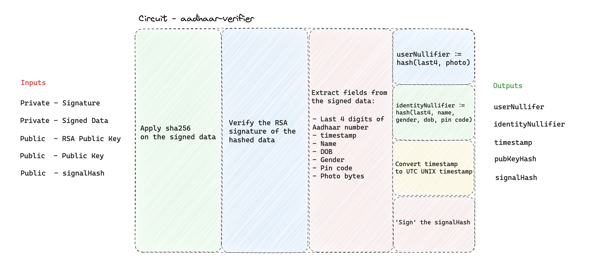

**Introducing Anon Aadhaar v1**

If you're learning about Anon Aadhaar for the first time, it's a protocol that enables Aadhaar holders to prove their identity anonymously. It verifies the Aadhaar card's issuer signature, issued by the Indian government in formats like PDF, XML, and Secure QR code. These digital versions are signed using RSA, involving a pair of keys: a private key for signing data and a public key for verification. Our protocol leverages the UIDAI's (the government agency responsible for Aadhaar cards) RSA signature, enabling us to verify the documents as anyone could. The novelty of our approach is the use of a SNARK proof in the verification process, which hides sensitive data from the verifier, maintaining the same level of verification while enhancing privacy.

**Recap of Previous Version Developments**

In the previous version, we implemented RSA verification in circom using Groth16. We used the eAadhaar PDF, which is easily downloadable by Aadhaar residents, for signature verification. However, we encountered two major issues:

1. The PDF's size was too large for circuit input.
2. A changing timestamp in the document made it impossible to have a consistent identity hash.

To overcome these obstacles, we transitioned to utilizing the [Aadhaar secure QR code](https://uidai.gov.in/en/ecosystem/authentication-devices-documents/qr-code-reader.html) for verification purposes. This method is not only broadly adopted but also readily accessible through the mAadhaar mobile application or via the printed version of the e-Aadhaar PDF. This adjustment enhances the efficiency of verifying signed identity data and streamlines the process of document parsing within our system.

**Key Features in v1.0.0**

1. **SHA-256 Hash Verification**: Leveraging the zk-email implementation, we've integrated SHA-256 hash verification alongside RSA verification, allowing us to work effectively with the signed data.

2. **Extractor**: With verified data, our new circom extractor implementation enables selective extraction of identity fields from the document.

3. **Nullifiers**: We're now computing two types of nullifiers:

   - **userNullifier**: A hash of the Aadhaar number's last 4 digits and the identity photo, addressing collision issues using unique photo bytes for app interactions.
   - **identityNullifier**: A hash of various identity elements like the last 4 digits, DOB, name, gender, and PIN code. This facilitates nullifier recovery if identity data changes. For example, if a user changes their photo, altering their userNullifier, they can still be linked to their previous interactions by providing all fields used in the userNullifier computation.

4. **Timestamp Check**: We extract and output the document's signature timestamp from the circuit, helping verifiers ensure the document's recent generation, acting as a proxy for user access to their UIDAI portal.

5. **Signal Signing**: This feature allows apps and users to sign arbitrary data while generating the proof, essential for ERC-4337 implementations. It enables Aadhaar-based transaction hash signatures and provides a solution to prevent front-running on-chain by committing to the `msg.sender` in smart contract interactions.

6. **Improved On-chain Verification Gas Cost**: Outputting the issuer's public key hash from the circuit allows us to store this value in the AnonAadhaar smart contract, reducing on-chain verification costs.

**Looking Forward**

We are incredibly excited to see what developers will build using Anon Aadhaar v1. To support and inspire your innovative projects, we've provided a variety of resources:

- [**Our GitHub Repository**](https://github.com/anon-aadhaar/anon-aadhaar): Dive into the codebase and explore the intricate workings of our protocol.
- [**An on-chain voting Example App**](https://github.com/anon-aadhaar/boilerplate): Get hands-on with a practical implementation to see how Anon Aadhaar can be integrated into real-world applications.
- [**A Quick Setup Repository**](https://github.com/anon-aadhaar/quick-setup): For those eager to get started, this repository provides a streamlined Nextjs setup process.

We're eager to witness the creative and impactful ways in which the developer community will utilize Anon Aadhaar, pushing the boundaries of privacy and security in digital identity verification. Happy coding!
