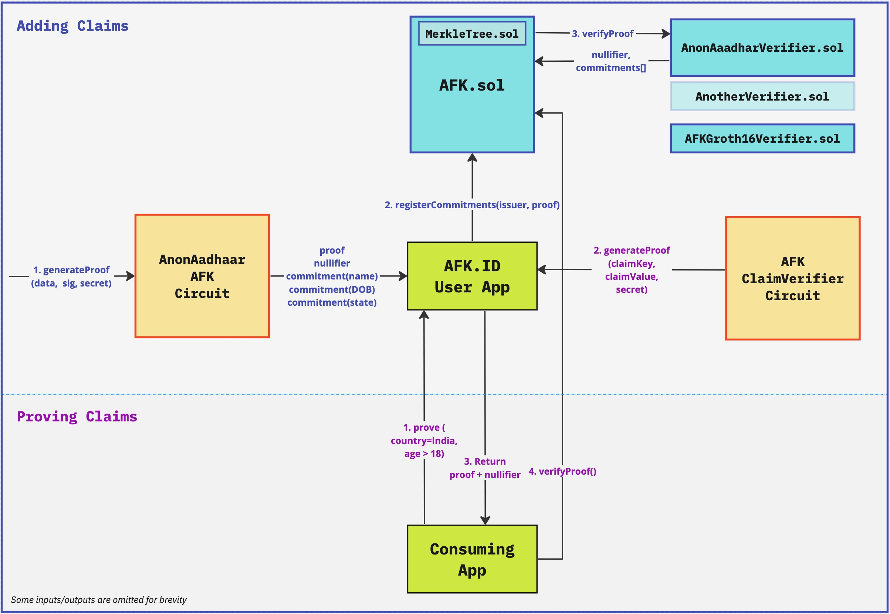
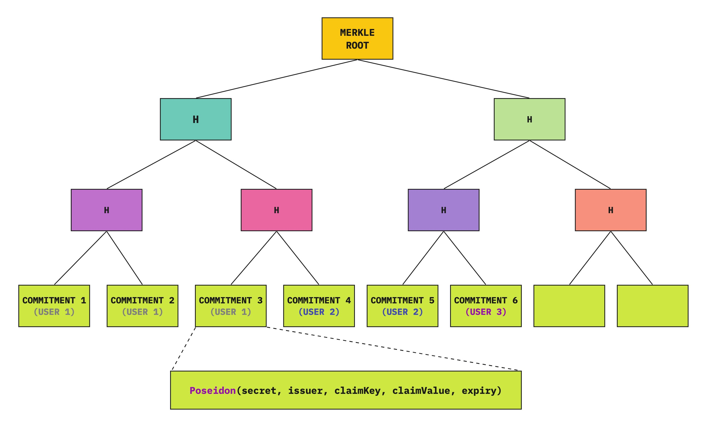

# Building an aggregated ZK identity system

## Introduction

We have seen a rise in ZK real-world identity protocols like AnonAadhaar, Proof-of-Passport, Myna Wallet, ZKEmail, etc. where users can prove some attributes about themselves without disclosing their entire data.

In this post, we are going to explore how we can build an aggregated identity protocol where users can claim identity attributes from multiple "issuers" like above and selectively reveal them to consuming applications as needed - i.e. work like an SSO for real-world identities of a person.

Let's call this protocol **AFK.ID**. (`AFK == Away From Keyboard == Real World`)

_This is only a brief overview of how such a system can be built and the challenges involved, and not a formal technical specification._

 

## TLDR;

- We create ZK circuits for each issuer - that verify the signature from the issuer, **extract claims, and output commitments to claims** (`hash(secret, claimKey, claimValue)`).
- These commitments along with the proof are sent to AFK.ID smart contract, which verifies the proof and **appends commitments to a Merkle tree**.
- The circuit also outputs a `nullifier` from the issuer (also stored in the smart contract) to prevent the user from reusing the same identity from an issuer with multiple AFK.ID accounts.
- When an application asks the user to log in (with some claim requirements), the user creates a **Merkle proof of the claim commitments** - which they can only do if they know the `secret` used in the commitments.
- The application can verify the proof and claim validity by cross-checking the Merkle root from the proof against the one stored in the smart contract.
- Note that the user only proves that they own commitments with the required claims, but **does not reveal the commitment itself** - which means there is no link to their other commitments, or to the `nullifier` from the issuer.
- Applications can also **provide a list of issuers they trust**, and then the user would need to prove claims from those issuers.
- Additionally, users can also prove they own a **claim whose value is lower or greater than a number** without disclosing the original value (for example: prove DOB > 2006).

 

## Terms

Before we dive into the details, let us define some terms that we will be using:

- Issuer: The system/protocol that issues signed identities - like Aadhaar, Passport, Degree Certificate, etc.
- Claim: Identity attributes of a person - like citizenship, name, date of birth, etc.
- AFK.ID app: The user-facing app where the user stores their claims and generates proof of it.
- Consuming app: On-chain or off-chain applications that integrate AFK.ID to verify users and validate claims.

## What are we building?

In a nutshell, we are building an **SSO service for a person's real-world identity**.

The essential protocol is only about committing to attested identity claims and making ownership proofs of these commitments. But in practice, we would need a user-facing app to store claims and interact with consuming applications to generate proofs as required by them.

Similar to how you "Sign in with Google" and allow the application to access your name, email, and optionally calendar, contacts, etc., users can sign in with AFK.ID and reveal things like their country, age above 18, etc.

For a consuming application:

- They can identify the same user across multiple sessions (`nullifier` would be the same).
- They can set conditions for a user to enter (like age above 18).
- They can be sure that the user is a real person (since the claims are from government-issued identities).
- They can optionally prevent one person from creating multiple accounts.

Apart from working like a mere SSO, consuming applications can also **ask the user to "sign" arbitrary data** along with proof of claims. This can be used for things like voting, signing an on-chain transaction, etc.

Since the proof can also be verified on-chain, AFK.ID can act as a **trustless oracle of real-world identities for on-chain applications**.

## What problems are we solving?

There already exists explicit ZK identity protocols like AnonAadhaar, but AFK.ID solves some additional problems:

- **Privacy with issuer** - In protocols like AnonAadhaar, the `nullifier` is derived from the signed data, and this allows the "issuer" (government) to identify a user and their on-chain "actions". In AFK.ID, the "issuer" can only find out a user "imported" claims to AFK.ID, but cannot identify someone based on their "actions" in a consuming on-chain application.
- **Aggregation** - Have one place for the user to "collect" claims from multiple sources and prove/reveal them when needed. This means the user doesn't need to install a different app for each issuer.
- **Private Proof-of-Personhood** - Proving you are human with AnonAadhaar (for example) implicitly proves you are an Indian resident. In AFK.ID you can prove you have a claim that you are a human from one of the accepted issuers, without revealing which issuer it is.
- **Faster Proofs** - Generating AnonAadhaar proof (for example) is expensive. In AFK.ID, we do this once (to commit to the extracted claims), but proving ownership of claims to a consuming app afterward is very fast - which results in a fast UX.
- **Easier integration** - Easier for applications as they only need to integrate with one system, instead of each issuer separately.
- **Easier for new issuers** - New issuers can easily integrate with AFK.ID by just building the necessary circuit, and not worrying about building SDK or user apps.

Consuming applications can also enjoy other benefits like **proof-of-personhood** (no bots), **sybil resistance** (one person, one account), and **privacy across applications** (not possible to link a user across applications based on the proof), but these were already possible by individual identity protocols.

Either way, AFK.ID would make it easy for **both on-chain and off-chain applications** very easy to integrate with real-world identities in a privacy-preserving manner.

## Expected User-flow

1. The user opens AFK.ID app for the first time, generates a secret and backs it up offline.
2. The user then scans one of their identity "card" and imports claims from them. For example:
   - Scan Aadhaar and import Name, DOB, State, City, etc.
   - Scan Passport and import Citizenship, Name, DOB
3. The user can continue "collecting" claims from other sources that are supported by AFK.ID over time.
4. When using a consuming app, the user clicks "Sign in with AFK.ID". The application redirects the user to AFK.ID app with the list of required claims and trusted issuers.
5. The user "approves" the login, generates the proof, and gets redirected back to the consuming app with the proof.
6. The consuming app will verify the proof, and then treat the user as "logged in" knowing that the user fulfills their requirements (for example: age above 18).
7. The consuming app will also receive a `nullifier` from AFK.ID which is something unique to the user - and can be considered as a "`userId`".

Note that instead of "signing in", the application can also ask the user to "perform an action" by proving their eligibility - like voting, or signing a transaction. The essential flow would be the same but with minor changes in the UI.

Moreover, the AFK.ID client app ideally needs to be **a mobile app** for security reasons (discussed below). And we would need a secure way of connecting AFK.ID mobile app with the consuming web app (_p2p connection with a QR code UI maybe_). We can also potentially **use FaceID** or similar options to authenticate sign in requests.

## How it works

The general idea of AFK.ID is to **extract claims** from an identity system (like AnonAadhaar) **and commit to them using a secret** that is only known to the user.

These commitments are then stored in a Merkle tree in a public Blockchain. When required to prove a claim, the user proves knowledge of the secret of a commitment in the Merkle tree.

In other words, the user is taking signed attestation to their identity claims from an issuer, and converting them to self-attested claims - which they can prove/reveal anytime.

Going more technical, AFK.ID consists of:

- ZK circuit to extract identity claims and commit to them - **for each issuer**.
- ZK circuit to prove ownership of claims in the claim commitment Merkle tree.
- Smart contract that verifies proof from each issuer.
- Smart contract that stores the Merkle tree of commitments and nullifiers, and verifies the claim ownership proof.
- Client application that stores identity claims, and generates ZK proof as needed by a consuming app.

### Creating identity

- When the user opens the app for the first time, they generate a `secret` and back it up offline.
- This secret is used to commit identity claims and prove ownership of them later.
- Ideally, this secret should be the private key of an asymmetric signature scheme, so the user can also sign messages/transactions with it if needed (outside of this protocol).

### Importing Claims

This is what happens when a user imports claims from a supported identity issuer:

- The ZK circuit for the issuer verifies the signature from the issuer and outputs:
  - Commitment to claims: `hash(secret, issuerId, claimKey, claimValue)`
    - where `secret` is the random number generated by the user (or their private key).
    - `issuerId` is a constant corresponding to the issuer, for example, `hash("AnonAadhaar")`.
    - `claimKey` is a constant corresponding to a claim, for example, `hash("dateOfBirth")`.
    - and `claimValue` is the actual value of that claim encoded as a number.
  - A `nullifier` that is unique for one user under the issuer.
- AFK.ID app submits the ZK proof and commitments to the AFK.ID smart contract.
- AFK.ID smart contract finds the verifier contract for the issuer (which is stored as a mapping in the contract) and calls its "`verifyProof()`" method.
- The verifier contract of the issuer verifies the proof and returns the commitments and the nullifier.
- The AFK.ID smart contract verifies that the nullifier was not seen before, and then saves the commitments to the Merkle tree.

### Proving claims

- The ZK circuit for the AFK.ID app takes in:
  - `secret`, `issuerId`, `claimKey`, `claimValue` for each claim that the user wants to prove along with their Merkle Path (indices of each row and value of sibling).
  - and outputs `merkleRoot` which is the root of the Merkle tree constructed based on the inputs.
- The circuit also outputs a `nullifier` (not to be confused with the `nullifier` from the issuer circuit) which is the `hash(secret, scope)` that can be used as an identifier for the user. i.e. if the same user sign in (i.e. generate claim proof) later, they will have the same nullifier, even if the claims requested are different.
- There is an additional public input to the circuit `allowedIssuerIds` which is the list of issuers trusted by the app. The circuit also checks if the `issuerId` in the commitment is one of the allowed values.
- In practice, the input `claimValue` needs to be replaced with `claimValueEq`, `claimValueGT` or `claimValueLT` to prove that the claim is greater or less than a value without revealing the actual value.
  - Note that the claim key and values need to be part of the proof (public output) here for an application to verify. So it makes sense to hide the original value when the claims are sensitive and use `claimValueGT`, `claimValueLT` instead.

### Verifying claims

Consuming apps can request the user to generate proof with statements like _"prove you have a claim with value `X` for the key `claimKey1`, which is issued by one of [`issuerId1`, `issuerId2`]"._

AFK.ID app can validate these requirements and can generate the proof accordingly.

- For a consuming app, if this Merkle root from the proof matches the one stored in the smart contract, they can be sure that the user has the required claims.
- This is because the user can only generate a valid Merkle proof if they know the `secret` used in the commitments.
- A `scope` set by the application is also an input to the circuit, which is used to generate the `nullifier`.
- Applications can treat this `nullifier` as a unique identifier for the user.
- Applications can also set the `scope` to an "`actionId`" to prevent users from doing an "action" more than once.
- Since the nullifier is derived from the `scope`, there is no connection between the same user across different on-chain applications (note that `nullifier` is public).

### Expiry mechanism

We also need an expiry mechanism for claims as claims issued by an issuer might not be valid forever.

The expiry date could come from the issuer itself (passport expiry date for example), and the ZK circuit for the issuer includes the expiry timestamp in the commitment.

Commitment now becomes `hash(secret, issuerId, claimKey, claimValue, expiryTimestamp)`.

When proving the claim, the user also proves that the claim's expiry date is less than the current time. Practically speaking, the current time will be a public output from the circuit which the verifier (app) can validate.

## Challenges

Some of the challenges in building a system link this is:

- **Storing the secret and claims**:
  - As you can see, the user-facing application needs to store the `secret` and the plain-text claim values to generate the proof later.
  - And thus, it is ideal that the client app is a mobile app and use secure storage mechanisms like Keychain/Keystore.
- **Fetching the whole Merkle tree**:
  - To generate a Merkle proof, the client needs to access all the leaves in the tree - i.e. every claim commitment of each user.
  - We can have the smart contract emit events whenever new claim commitments are registered, but fetching or syncing this data in the client is difficult.
  - A solution is to have a server (or a subgraph if possible) that can return just the Merkle path for a given commitment. This way the client doesn't need to fetch all the claims.
  - There is a small privacy concern here as the server can know which commitment is being queried by the client (by their IP address). However, the client has the freedom to choose the server they trust; or they can simply download all leaves from the server/subgraph.
- **Race conditions**:
  - Since we are dealing with a Merkle tree updated by multiple users, the Merkle root might change (due to someone else adding commitments) by the time the user generates their proof.
  - A solution for this is to have the smart contract maintain that last X Merkle roots. The application can check if the Merkle root is in the proof is any one of them.
- **Separate circuits for each issuer**:
  - We need to design separate circuits for each issuer. There already exists solutions like AnonAadhaar, Proof-of-Passport, etc. but those circuits need to be wrapped under a new circuit where the public outputs are commitments to claims instead of the actual claims.
- **UX for each issuer**:
  AFK.ID app needs to import claims from multiple issuers. This means the app needs to have UX to "scan" and parse each issuer document based on their spec. This is something that would need to be done explicitly for each issuer.

### FAQ

#### 1. How is it different from other identity aggregation protocols?

There already exist a few protocols that work like an aggregated ZK identity system, but in most cases, the issuer is a centralized server. On-boarding governments, educational institutions, etc. as issuers in a specific protocol could be challenging.

In AFK.ID, the issuer is a ZK circuit that essentially verifies the signature on government-issued identities. There is no extra step needed from the issuer.

Moreover, claims issued in other protocols (by a centralized server) can also be optionally imported to AFK.ID by creating a circuit that verifies the signature from that protocol.

#### 2. What to do if the user loses access to the secret?

The user cannot create a new secret and import claims again, as the `nullifier` from the issuer will be the same and it will be rejected by the smart contract.

One solution would be to have the expiry date for the `nullifier` as well - the same value that is set to claims (a fixed, shorter duration). This way, the user can wait for the `nullifier` to expire, create a new account (new `secret`) and then import claims again.

However, for the consuming application, the user will be like a new user as the `nullifier` (which acts as the unique identifier) from AFK.ID is derived from `secret`.

#### 3. What if the issuer revokes or updates someone's identity?

One downside of the system is that the user can continue authenticating their claims even if it (the original identity document) is revoked by the issuer. For example, a government revokes someone's passport if they are no longer a citizen.
A reasonable solution is to have the expiry set to a short duration, so the claims are only valid till that time.
A downside of this is that every user would need to re-import their claims periodically.

#### 4. How can we ensure one person is not creating multiple AFK.ID accounts?

Nothing is stopping a user from creating multiple AFK.ID accounts with different secrets. However they cannot import identity claims from one provider to multiple AFK.ID accounts (assuming the `nullifier` from the provider is always the same for one person)

But there is one important thing to note here - the user can import claims like `DOB` from multiple sources to different AFK.ID account; and prove they are a person above 18 years (for example) to the same app twice.

There is no straightforward solution to this, but one way would be for the app to accept only one issuer that is popular among its target audience.

#### 5. How can we ensure claims from multiple issuers belong to the same person?

This is not something enforced in the protocol, as the general assumption is the possessor of the 'signed identity' is the owner.

One solution would have been to check for common claims like `name` and `DOB` are the same across multiple issuers, but this is hard to do with the current setup, and also not a foolproof solution as every issuer would not have the same claims.

#### 6. What kind of systems can become an issuer?

The only requirements for AFK.ID issuer is:

- to have a ZK circuit (in any proof system) that can export claim commitments with the required hashing scheme (Poseidon).
- and the proof can be verified on-chain at a reasonable cost.

#### 7. Can other cryptographic techniques improve/obsolete this system?

- If we can verify a snark proof inside another circuit, then we would not need a wrapper circuit for existing identity protocols like AnonAadhaar.
- Private blockchains (or L2) like [Aztec](https://aztec.network/) can potentially hide the actions of a user from the issuer.
- [FHE](https://en.wikipedia.org/wiki/Homomorphic_encryption) can also hide actions from the issuer (when it becomes practical).

## Conclusion

A unified identity system based on real-world identities can be beneficial for both Web 2.0 and Web 3.0 applications.

To make this practical, we need to "snarkify" more signed documents and also work with existing ZK identity teams to support such a protocol. We also need to collaborate to decide the structure of commitments, verifier interface for issuers, SDK interface for consuming apps, etc. and come up with a formal spec for the protocol.
